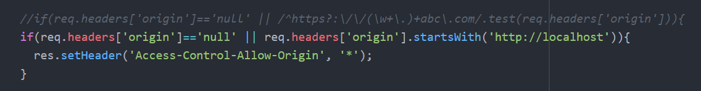

# formdata

前台浏览器ajax2.0的东西

## 入门

- set(key, value)           会覆盖
- append(key, value)        不覆盖
- get(key)=>value
- delete(key)

1.html

```html
<!DOCTYPE html>
<html>
  <head>
    <meta charset="utf-8">
    <title></title>
    <script>
    let data=new FormData();

    data.set('user', 'blue');
    data.append('user', 'blue2');

    console.log(data.getAll('user'));
    </script>
  </head>
  <body>

  </body>
</html>

```

## 控制提交数据

### 原生实现

#### 前台

2.html

```html
<!DOCTYPE html>
<html>
  <head>
    <meta charset="utf-8">
    <title></title>
    <script>
    window.onload=function (){
      let oUser=document.getElementById('user');
      let oPass=document.getElementById('pass');
      let oBtn=document.getElementById('btn1');

      oBtn.onclick=function (){
        let data=new FormData();

        data.set('user', oUser.value);
        data.set('pass', oPass.value);

        //
        let oAjax=new XMLHttpRequest();

        //GET
        let arr=[];
        data.forEach((value, key)=>{
          arr.push(`${encodeURIComponent(key)}=${encodeURIComponent(value)}`);
        });
        oAjax.open('GET', `http://localhost:8080/api?${arr.join('&')}`, true);
        oAjax.setRequestHeader('my-origin-blue', window.location.hostname);
        oAjax.send();

        //POST
        /*oAjax.open('POST', `http://localhost:8080/api`, true);
        oAjax.setRequestHeader('Content-Type', 'application/x-www-form-urlencoded');
        oAjax.send(data);*/

        oAjax.onreadystatechange=function (){
          if(oAjax.readyState==4){
            if(oAjax.status>=200 && oAjax.status<300 || oAjax.status==304){
              alert('成功:'+oAjax.responseText);
            }else{
              alert('失败');
            }
          }
        };
      };
    };
    </script>
  </head>
  <body>
    用户：<input type="text" id="user" /><br>
    密码：<input type="password" id="pass" /><br>
    <input type="button" value="提交" id="btn1">
  </body>
</html>

```

#### 后台

server.js

```js
const http=require('http');
const urlLib=require('url');
const querystring=require('querystring');

http.createServer((req, res)=>{
  console.log(req.headers['my-origin-blue']);

  //if(req.headers['origin']=='null' || /^https?:\/\/(\w+\.)+abc\.com/.test(req.headers['origin'])){
  if(req.headers['origin']=='null' || req.headers['origin'].startsWith('http://localhost')){
    res.setHeader('Access-Control-Allow-Origin', '*');
  }

  let {pathname: url, query: get}=urlLib.parse(req.url, true);

  let arr=[];
  req.on('data', data=>{
    arr.push(data);
  });
  req.on('end', ()=>{
    let post=querystring.parse(Buffer.concat(arr).toString());

    console.log(url, get, post);

    res.write('asdfasdf');
    res.end();
  });
}).listen(8080);

```


## 文件上传

### express框架实现

#### 安装依赖

package.json

```json
{
  "name": "2018-2-6",
  "version": "1.0.0",
  "description": "",
  "main": "1.js",
  "scripts": {
    "test": "echo \"Error: no test specified\" && exit 1",
    "start": "node server.js"
  },
  "keywords": [],
  "author": "",
  "license": "ISC",
  "devDependencies": {
    "body-parser": "^1.18.2",
    "express": "^4.16.2",
    "multer": "^1.3.0"
  }
}

```

#### 前台

3.html

```html
<!DOCTYPE html>
<html>
  <head>
    <meta charset="utf-8">
    <title></title>
    <script>
    window.onload=function (){
      let oUser=document.getElementById('user');
      let oPass=document.getElementById('pass');
      let oF=document.getElementById('f1');
      let oBtn=document.getElementById('btn1');

      oBtn.onclick=function (){
        let data=new FormData();

        data.set('user', oUser.value);
        data.set('pass', oPass.value);

        Array.from(oF.files).forEach(file=>{
          data.append('f1', file);
        });

        //
        let oAjax=new XMLHttpRequest();

        //POST
        oAjax.open('POST', `http://localhost:8080/api`, true);
        oAjax.send(data);

        oAjax.onreadystatechange=function (){
          if(oAjax.readyState==4){
            if(oAjax.status>=200 && oAjax.status<300 || oAjax.status==304){
              alert('成功');
            }else{
              alert('失败');
            }
          }
        };
      };
    };
    </script>
  </head>
  <body>
    用户：<input type="text" id="user" /><br>
    密码：<input type="password" id="pass" /><br>
    头像：<input type="file" id="f1" multiple /><br>
    <input type="button" value="提交" id="btn1">
  </body>
</html>

```

#### 后台

express_server.js

```js
const express=require('express');     //主体
const body=require('body-parser');    //接收普通POST数据
const multer=require('multer');       //接收文件POST数据

//let server=http.createServer((req, res)=>{});
//server.listen(8080);

let server=express();
server.listen(8080);

//中间件
server.use(body.urlencoded({extended: false}));

let multerObj=multer({dest: './upload/'});
server.use(multerObj.any());

//处理请求
server.post('/api', (req, res)=>{
  if(req.headers['origin']=='null' || req.headers['origin'].startsWith('http://localhost')){
    res.setHeader('Access-Control-Allow-Origin', '*');
  }

  res.send("OK");

  console.log(req.body);      //普通POST数据
  console.log(req.files);     //文件POST数据，req.files来自于multer
});

//
server.use(express.static('./www/'));

```

# cors跨域

早期跨域解决方案是使用`jsonp`

ajax1.0的时代，浏览器请求服务器的时候，请求头并不会携带`origin`,对于跨域的解决方案是使用其它的手段。

ajax2.0以后，浏览器请求服务器，请求头中会有`origin` ,服务器接到请求要验证请求头中的`origin`认不认识

- 认识的话则进行设置`  res.setHeader('Access-Control-Allow-Origin', '*');`

浏览器接收服务器的响应后，查看响应头中`Access-Control-Allow-Origin`是否进行了设置，如果设置了`*`，则表示允许本次请求后成功处理响应。

## 关键代码



# 文件拖拽 #

- ondragenter	拖着东西进入
- ondragleave    拖着东西离开
- ondragover      悬停
- ondrop     松手

## 代码

```html
<!DOCTYPE html>
<html>
  <head>
    <meta charset="utf-8">
    <title></title>
    <style media="screen">
    .box {width:400px; height:150px; border:1px solid black; background:#CCC; position: absolute; margin-left: -200px; margin-top: -75px; left:50%; top:50%; text-align:center; line-height:150px;}
    </style>
    <script>
    window.onload=function (){
      let oBox=document.querySelector('.box');

      oBox.ondragenter=function (){
        oBox.innerHTML='松手上传';
      };
      oBox.ondragleave=function (){
        oBox.innerHTML='请拖到这里';
      };

      oBox.ondragover=function (){      //只要鼠标还没松手、并且还没离开，一直不停发生
        console.log("aaaa");

        //ondragover不阻止默认事件，ondrop不会触发
        return false;
      };
      oBox.ondrop=function (ev){
        //alert('松手');

        let data=new FormData();

        Array.from(ev.dataTransfer.files).forEach(file=>{
          data.append('f1', file);
        });

        //
        let oAjax=new XMLHttpRequest();

        //POST
        oAjax.open('POST', `http://localhost:8080/api`, true);
        oAjax.send(data);

        oAjax.onreadystatechange=function (){
          if(oAjax.readyState==4){
            if(oAjax.status>=200 && oAjax.status<300 || oAjax.status==304){
              alert('上传成功');
            }else{
              alert('上传失败');
            }
          }
        };

        return false;
      };
    };
    </script>
  </head>
  <body>
    <div class="box">
      请拖到这里
    </div>
  </body>
</html>

```


