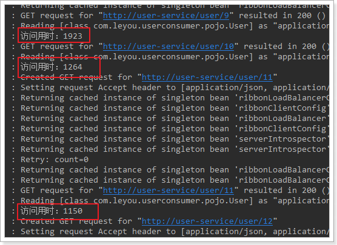
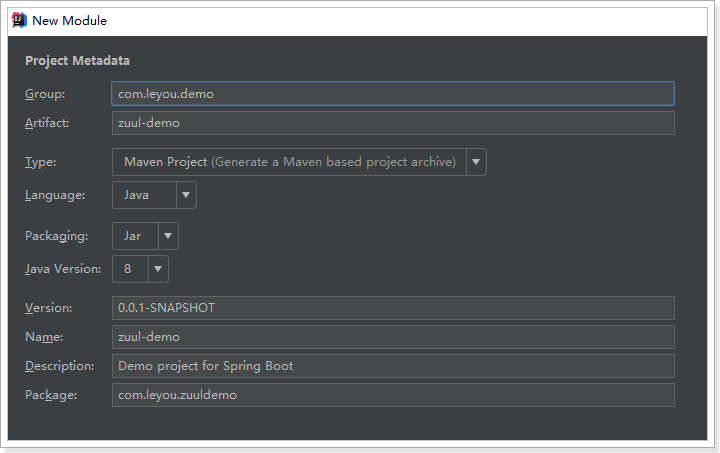
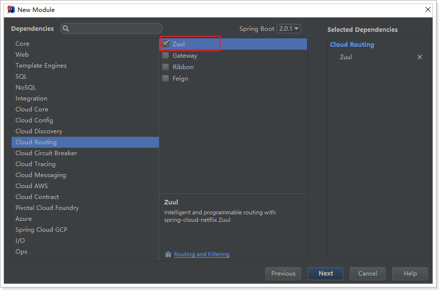

> # 学习目标

- 会配置Hystix熔断
- 会使用Feign进行远程调用
- 能独立搭建Zuul网关
- 能编写Zuul的拦截器


> # Hystix

> ## 简介

Hystix，即熔断器。

主页：https://github.com/Netflix/Hystrix/


Hystix是Netflix开源的一个延迟和容错库，用于隔离访问远程服务、第三方库，防止出现级联失败。


> ## 熔断器的工作机制：


正常工作的情况下，客户端请求调用服务API接口：


当有服务出现异常时，直接进行失败回滚，服务降级处理：


当服务繁忙时，如果服务出现异常，不是粗暴的直接报错，而是返回一个友好的提示，虽然拒绝了用户的访问，但是会返回一个结果。

这就好比去买鱼，平常超市买鱼会额外赠送杀鱼的服务。等到逢年过节，超时繁忙时，可能就不提供杀鱼服务了，这就是服务的降级。

系统特别繁忙时，一些次要服务暂时中断，优先保证主要服务的畅通，一切资源优先让给主要服务来使用，在双十一、618时，京东天猫都会采用这样的策略。


> ## 动手实践

> ### 引入依赖

首先在user-consumer中引入Hystix依赖：

```xml
<dependency>
    <groupId>org.springframework.cloud</groupId>
    <artifactId>spring-cloud-starter-netflix-hystrix</artifactId>
</dependency>
```

> ### 开启熔断


> ### 改造消费者

我们改造user-consumer，添加一个用来访问的user服务的DAO，并且声明一个失败时的回滚处理函数：

```java
@Component
public class UserDao {

    @Autowired
    private RestTemplate restTemplate;

    private static final Logger logger = LoggerFactory.getLogger(UserDao.class);

    @HystrixCommand(fallbackMethod = "queryUserByIdFallback")
    public User queryUserById(Long id){
        long begin = System.currentTimeMillis();
        String url = "http://user-service/user/" + id;
        User user = this.restTemplate.getForObject(url, User.class);
        long end = System.currentTimeMillis();
        // 记录访问用时：
        logger.info("访问用时：{}", end - begin);
        return user;
    }

    public User queryUserByIdFallback(Long id){
        User user = new User();
        user.setId(id);
        user.setName("用户信息查询出现异常！");
        return user;
    }
}
```

- `@HystrixCommand(fallbackMethod="queryUserByIdFallback")`：声明一个失败回滚处理函数queryUserByIdFallback，当queryUserById执行超时（默认是1000毫秒），就会执行fallback函数，返回错误提示。
- 为了方便查看熔断的触发时机，我们记录请求访问时间。

在原来的业务逻辑中调用这个DAO：

```java
@Service
public class UserService {

    @Autowired
    private UserDao userDao;

    public List<User> queryUserByIds(List<Long> ids) {
        List<User> users = new ArrayList<>();
        ids.forEach(id -> {
            // 我们测试多次查询，
            users.add(this.userDao.queryUserById(id));
        });
        return users;
    }
}
```

> ### 改造服务提供者

改造服务提供者，随机休眠一段时间，以触发熔断：

```java
@Service
public class UserService {

    @Autowired
    private UserMapper userMapper;

    public User queryById(Long id) throws InterruptedException {
        // 为了演示超时现象，我们在这里然线程休眠,时间随机 0~2000毫秒
        Thread.sleep(new Random().nextInt(2000));
        return this.userMapper.selectByPrimaryKey(id);
    }
}

```

> ### 启动测试

然后运行并查看日志：

id为9、10、11的访问时间分别是：

 

id为12的访问时间：

 

因此，只有12是正常访问，其它都会触发熔断，我们来查看结果：


> ### 优化

虽然熔断实现了，但是我们的重试机制似乎没有生效，是这样吗？

其实这里是因为我们的Ribbon超时时间设置的是1000ms:

​	

而Hystix的超时时间默认也是1000ms，因此重试机制没有被触发，而是先触发了熔断。

所以，Ribbon的超时时间一定要小于Hystix的超时时间。

我们可以通过`hystrix.command.default.execution.isolation.thread.timeoutInMilliseconds`来设置Hystrix超时时间。

```yaml
hystrix:
  command:
  	default:
        execution:
          isolation:
            thread:
              timeoutInMillisecond: 6000 # 设置hystrix的超时时间为6000ms
```


> # Feign

在前面的学习中，我们使用了Ribbon的负载均衡功能，大大简化了远程调用时的代码：

```java
String baseUrl = "http://user-service/user/";
User user = this.restTemplate.getForObject(baseUrl + id, User.class)
```

如果就学到这里，你可能以后需要编写类似的大量重复代码，格式基本相同，无非参数不一样。有没有更优雅的方式，来对这些代码再次优化呢？

这就是我们接下来要学的Feign的功能了。

> ## 简介

有道词典的英文解释：

​	

为什么叫伪装？

Feign可以把Rest的请求进行隐藏，伪装成类似SpringMVC的Controller一样。你不用再自己拼接url，拼接参数等等操作，一切都交给Feign去做。


项目主页：https://github.com/OpenFeign/feign


> ## 快速入门

> ### 导入依赖

```xml
<dependency>
    <groupId>org.springframework.cloud</groupId>
    <artifactId>spring-cloud-starter-openfeign</artifactId>
</dependency>
```

> ### Feign的客户端

```java
@FeignClient("user-service")
public interface UserFeignClient {

    @GetMapping("/user/{id}")
    User queryUserById(@PathVariable("id") Long id);
}
```

- 首先这是一个接口，Feign会通过动态代理，帮我们生成实现类。这点跟mybatis的mapper很像
- `@FeignClient`，声明这是一个Feign客户端，类似`@Mapper`注解。同时通过`value`属性指定服务名称
- 接口中的定义方法，完全采用SpringMVC的注解，Feign会根据注解帮我们生成URL，并访问获取结果

改造原来的调用逻辑，不再调用UserDao：

```java
@Service
public class UserService {

    @Autowired
    private UserFeignClient userFeignClient;

    public List<User> queryUserByIds(List<Long> ids) {
        List<User> users = new ArrayList<>();
        ids.forEach(id -> {
            // 我们测试多次查询，
            users.add(this.userFeignClient.queryUserById(id));
        });
        return users;
    }
}
```

> ### 开启Feign功能

我们在启动类上，添加注解，开启Feign功能

```java
@SpringBootApplication
@EnableDiscoveryClient
@EnableHystrix
@EnableFeignClients // 开启Feign功能
public class UserConsumerDemoApplication {
    public static void main(String[] args) {
        SpringApplication.run(UserConsumerDemoApplication.class, args);
    }
}
```

- 你会发现RestTemplate的注册被我删除了。Feign中已经自动集成了Ribbon负载均衡，因此我们不需要自己定义RestTemplate了

> ### 启动测试：

访问接口：

 

正常获取到了结果。

> ## 负载均衡

Feign中本身已经集成了Ribbon依赖和自动配置：

​	

因此我们不需要额外引入依赖，也不需要再注册`RestTemplate`对象。

另外，我们可以像上节课中讲的那样去配置Ribbon，可以通过`ribbon.xx`来进行全局配置。也可以通过`服务名.ribbon.xx`来对指定服务配置：

```yaml
user-service:
  ribbon:
    ConnectTimeout: 250 # 连接超时时间(ms)
    ReadTimeout: 1000 # 通信超时时间(ms)
    OkToRetryOnAllOperations: true # 是否对所有操作重试
    MaxAutoRetriesNextServer: 1 # 同一服务不同实例的重试次数
    MaxAutoRetries: 1 # 同一实例的重试次数
```

> ## Hystix支持

Feign默认也有对Hystix的集成：

​	

只不过，默认情况下是关闭的。我们需要通过下面的参数来开启：

```yaml
feign:
  hystrix:
    enabled: true # 开启Feign的熔断功能
```

但是，Feign中的Fallback配置不像Ribbon中那样简单了。

1）首先，我们要定义一个类，实现刚才编写的UserFeignClient，作为fallback的处理类

```java
@Component
public class UserFeignClientFallback implements UserFeignClient {
    @Override
    public User queryUserById(Long id) {
        User user = new User();
        user.setId(id);
        user.setName("用户查询出现异常！");
        return user;
    }
}

```

2）然后在UserFeignClient中，指定刚才编写的实现类

```java
@FeignClient(value = "user-service", fallback = UserFeignClientFallback.class)
public interface UserFeignClient {

    @GetMapping("/user/{id}")
    User queryUserById(@PathVariable("id") Long id);
}

```

3）重启测试：

我们关闭user-service服务，然后在页面访问：


> ## 请求压缩(了解)

Spring Cloud Feign 支持对请求和响应进行GZIP压缩，以减少通信过程中的性能损耗。通过下面的参数即可开启请求与响应的压缩功能：

```yaml
feign:
  compression:
    request:
      enabled: true # 开启请求压缩
    response:
      enabled: true # 开启响应压缩
```

同时，我们也可以对请求的数据类型，以及触发压缩的大小下限进行设置：

```yaml
feign:
  compression:
    request:
      enabled: true # 开启请求压缩
      mime-types: text/html,application/xml,application/json # 设置压缩的数据类型
      min-request-size: 2048 # 设置触发压缩的大小下限
```

注：上面的数据类型、压缩大小下限均为默认值。


> ## 日志级别(了解)

前面讲过，通过`logging.level.xx=debug`来设置日志级别。然而这个对Fegin客户端而言不会产生效果。因为`@FeignClient`注解修改的客户端在被代理时，都会创建一个新的Fegin.Logger实例。我们需要额外指定这个日志的级别才可以。

1）设置com.leyou包下的日志级别都为debug

```yaml
logging:
  level:
    com.leyou: debug
```

2）编写配置类，定义日志级别

```java
@Configuration
public class FeignConfig {
    @Bean
    Logger.Level feignLoggerLevel(){
        return Logger.Level.FULL;
    }
}
```

这里指定的Level级别是FULL，Feign支持4种级别：

​	

- NONE：不记录任何日志信息，这是默认值。
- BASIC：仅记录请求的方法，URL以及响应状态码和执行时间
- HEADERS：在BASIC的基础上，额外记录了请求和响应的头信息
- FULL：记录所有请求和响应的明细，包括头信息、请求体、元数据。


3）在FeignClient中指定配置类：

```java
@FeignClient(value = "user-service", fallback = UserFeignClientFallback.class, configuration = FeignConfig.class)
public interface UserFeignClient {
    @GetMapping("/user/{id}")
    User queryUserById(@PathVariable("id") Long id);
}
```

4）重启项目，即可看到每次访问的日志：


> # Zuul网关

通过前面的学习，使用Spring Cloud实现微服务的架构基本成型，大致是这样的：


我们使用Spring Cloud Netflix中的Eureka实现了服务注册中心以及服务注册与发现；而服务间通过Ribbon或Feign实现服务的消费以及均衡负载；通过Spring Cloud Config实现了应用多环境的外部化配置以及版本管理。为了使得服务集群更为健壮，使用Hystrix的融断机制来避免在微服务架构中个别服务出现异常时引起的故障蔓延。

 

在该架构中，我们的服务集群包含：内部服务Service A和Service B，他们都会注册与订阅服务至Eureka Server，而Open Service是一个对外的服务，通过均衡负载公开至服务调用方。我们把焦点聚集在对外服务这块，直接暴露我们的服务地址，这样的实现是否合理，或者是否有更好的实现方式呢？

 

先来说说这样架构需要做的一些事儿以及存在的不足：

- 首先，破坏了服务无状态特点。
  - 为了保证对外服务的安全性，我们需要实现对服务访问的权限控制，而开放服务的权限控制机制将会贯穿并污染整个开放服务的业务逻辑，这会带来的最直接问题是，破坏了服务集群中REST API无状态的特点。
  -  从具体开发和测试的角度来说，在工作中除了要考虑实际的业务逻辑之外，还需要额外考虑对接口访问的控制处理。
- 其次，无法直接复用既有接口。
  - 当我们需要对一个即有的集群内访问接口，实现外部服务访问时，我们不得不通过在原有接口上增加校验逻辑，或增加一个代理调用来实现权限控制，无法直接复用原有的接口。


面对类似上面的问题，我们要如何解决呢？答案是：服务网关！


为了解决上面这些问题，我们需要将权限控制这样的东西从我们的服务单元中抽离出去，而最适合这些逻辑的地方就是处于对外访问最前端的地方，我们需要一个更强大一些的均衡负载器的 服务网关。

 

服务网关是微服务架构中一个不可或缺的部分。通过服务网关统一向外系统提供REST API的过程中，除了具备服务路由、均衡负载功能之外，它还具备了`权限控制`等功能。Spring Cloud Netflix中的Zuul就担任了这样的一个角色，为微服务架构提供了前门保护的作用，同时将权限控制这些较重的非业务逻辑内容迁移到服务路由层面，使得服务集群主体能够具备更高的可复用性和可测试性。


> ## 简介

官网：https://github.com/Netflix/zuul

​	

Zuul：维基百科：

电影《捉鬼敢死队》中的怪兽，Zuul，在纽约引发了巨大骚乱。

事实上，在微服务架构中，Zuul就是守门的大Boss！一夫当关，万夫莫开！


> ## Zuul加入后的架构


- 不管是来自于客户端（PC或移动端）的请求，还是服务内部调用。一切对服务的请求都会经过Zuul这个网关，然后再由网关来实现 鉴权、动态路由等等操作。Zuul就是我们服务的统一入口。

> ## 快速入门

> ### 新建工程

填写基本信息：



添加Zuul依赖：



> ### 编写启动类

通过`@EnableZuulProxy `注解开启Zuul的功能：

```java
@SpringBootApplication
@EnableZuulProxy // 开启Zuul的网关功能
public class ZuulDemoApplication {

	public static void main(String[] args) {
		SpringApplication.run(ZuulDemoApplication.class, args);
	}
}
```

> ### 编写配置

```yaml
server:
  port: 10010 #服务端口
spring: 
  application:  
    name: api-gateway #指定服务名
```

> ### 编写路由规则

我们需要用Zuul来代理user-service服务，先看一下控制面板中的服务状态：


- ip为：127.0.0.1
- 端口为：8081

映射规则：

```yaml
zuul:
  routes:
    user-service: # 这里是路由id，随意写
      path: /user-service/** # 这里是映射路径
      url: http://127.0.0.1:8081 # 映射路径对应的实际url地址
```

我们将符合`path` 规则的一切请求，都代理到 `url`参数指定的地址

本例中，我们将 `/user-service/**`开头的请求，代理到http://127.0.0.1:8081

> ### 启动测试：

访问的路径中需要加上配置规则的映射路径，我们访问：http://127.0.0.1:8081/user-service/user/10

​	


> ## 面向服务的路由

在刚才的路由规则中，我们把路径对应的服务地址写死了！如果同一服务有多个实例的话，这样做显然就不合理了。

我们应该根据服务的名称，去Eureka注册中心查找 服务对应的所有实例列表，然后进行动态路由才对！


> ### 添加Eureka客户端依赖

```xml
<dependency>
    <groupId>org.springframework.cloud</groupId>
    <artifactId>spring-cloud-starter-netflix-eureka-client</artifactId>
</dependency>
```


> ### 开启Eureka客户端发现功能

```java
@SpringBootApplication
@EnableZuulProxy // 开启Zuul的网关功能
@EnableDiscoveryClient
public class ZuulDemoApplication {

	public static void main(String[] args) {
		SpringApplication.run(ZuulDemoApplication.class, args);
	}
}
```

> ### 添加Eureka配置，获取服务信息

```yaml
eureka:
  client:
    registry-fetch-interval-seconds: 5 # 获取服务列表的周期：5s
    service-url:
      defaultZone: http://127.0.0.1:10086/eureka
  instance:
    prefer-ip-address: true
    ip-address: 127.0.0.1
```

> ### 修改映射配置，通过服务名称获取

因为已经有了Eureka客户端，我们可以从Eureka获取服务的地址信息，因此映射时无需指定IP地址，而是通过服务名称来访问，而且Zuul已经集成了Ribbon的负载均衡功能。

```yaml
zuul:
  routes:
    user-service: # 这里是路由id，随意写
      path: /user-service/** # 这里是映射路径
      serviceId: user-service # 指定服务名称
```


> ### 启动测试

再次启动，这次Zuul进行代理时，会利用Ribbon进行负载均衡访问：

​	

日志中可以看到使用了负载均衡器：


> ## 简化的路由配置

在刚才的配置中，我们的规则是这样的：

- `zuul.routes.<route>.path=/xxx/**`： 来指定映射路径。`<route>`是自定义的路由名
- `zuul.routes.<route>.serviceId=/user-service`：来指定服务名。

而大多数情况下，我们的`<route>`路由名称往往和 服务名会写成一样的。因此Zuul就提供了一种简化的配置语法：`zuul.routes.<serviceId>=<path>`

比方说上面我们关于user-service的配置可以简化为一条：

```yaml
zuul:
  routes:
    user-service: /user-service/** # 这里是映射路径
```

省去了对服务名称的配置。

> ## 默认的路由规则

在使用Zuul的过程中，上面讲述的规则已经大大的简化了配置项。但是当服务较多时，配置也是比较繁琐的。因此Zuul就指定了默认的路由规则：

- 默认情况下，一切服务的映射路径就是服务名本身。
  - 例如服务名为：`user-service`，则默认的映射路径就是：`/user-service/**`

也就是说，刚才的映射规则我们完全不配置也是OK的，不信就试试看。

> ## 路由前缀

配置示例：

```yaml
zuul:
  prefix: /api # 添加路由前缀
  routes:
      user-service: # 这里是路由id，随意写
        path: /user-service/** # 这里是映射路径
        service-id: user-service # 指定服务名称
```

我们通过`zuul.prefix=/api`来指定了路由的前缀，这样在发起请求时，路径就要以/api开头。

路径`/api/user-service/user/1`将会被代理到`/user-service/user/1`


> ## 过滤器

Zuul作为网关的其中一个重要功能，就是实现请求的鉴权。而这个动作我们往往是通过Zuul提供的过滤器来实现的。

> ### ZuulFilter

ZuulFilter是过滤器的顶级父类。在这里我们看一下其中定义的4个最重要的方法：

```java
public abstract ZuulFilter implements IZuulFilter{

    abstract public String filterType();

    abstract public int filterOrder();
    
    boolean shouldFilter();// 来自IZuulFilter

    Object run() throws ZuulException;// IZuulFilter
}
```

- `shouldFilter`：返回一个`Boolean`值，判断该过滤器是否需要执行。返回true执行，返回false不执行。
- `run`：过滤器的具体业务逻辑。
- `filterType`：返回字符串，代表过滤器的类型。包含以下4种：
  - `pre`：请求在被路由之前执行
  - `routing`：在路由请求时调用
  - `post`：在routing和errror过滤器之后调用
  - `error`：处理请求时发生错误调用
- `filterOrder`：通过返回的int值来定义过滤器的执行顺序，数字越小优先级越高。


> ### 过滤器执行生命周期：

这张是Zuul官网提供的请求生命周期图，清晰的表现了一个请求在各个过滤器的执行顺序。

​	

- 正常流程：
  - 请求到达首先会经过pre类型过滤器，而后到达routing类型，进行路由，请求就到达真正的服务提供者，执行请求，返回结果后，会到达post过滤器。而后返回响应。
- 异常流程：
  - 整个过程中，pre或者routing过滤器出现异常，都会直接进入error过滤器，再error处理完毕后，会将请求交给POST过滤器，最后返回给用户。
  - 如果是error过滤器自己出现异常，最终也会进入POST过滤器，而后返回。
  - 如果是POST过滤器出现异常，会跳转到error过滤器，但是与pre和routing不同的时，请求不会再到达POST过滤器了。

所有内置过滤器列表：

​	

> ### 使用场景

场景非常多：

- 请求鉴权：一般放在pre类型，如果发现没有访问权限，直接就拦截了
- 异常处理：一般会在error类型和post类型过滤器中结合来处理。
- 服务调用时长统计：pre和post结合使用。

> ## 自定义过滤器

接下来我们来自定义一个过滤器，模拟一个登录的校验。基本逻辑：如果请求中有access-token参数，则认为请求有效，放行。

> ### 定义过滤器类

```java
@Component
public class LoginFilter extends ZuulFilter{
    @Override
    public String filterType() {
        // 登录校验，肯定是在前置拦截
        return "pre";
    }

    @Override
    public int filterOrder() {
        // 顺序设置为1
        return 1;
    }

    @Override
    public boolean shouldFilter() {
        // 返回true，代表过滤器生效。
        return true;
    }

    @Override
    public Object run() throws ZuulException {
        // 登录校验逻辑。
        // 1）获取Zuul提供的请求上下文对象
        RequestContext ctx = RequestContext.getCurrentContext();
        // 2) 从上下文中获取request对象
        HttpServletRequest req = ctx.getRequest();
        // 3) 从请求中获取token
        String token = req.getParameter("access-token");
        // 4) 判断
        if(token == null || "".equals(token.trim())){
            // 没有token，登录校验失败，拦截
            ctx.setSendZuulResponse(false);
            // 返回401状态码。也可以考虑重定向到登录页。
            ctx.setResponseStatusCode(HttpStatus.UNAUTHORIZED.value());
        }
        // 校验通过，可以考虑把用户信息放入上下文，继续向后执行
        return null;
    }
}

```


> ### 测试

没有token参数时，访问失败：

​	

添加token参数后：

​	

> ## 负载均衡和熔断

Zuul中默认就已经集成了Ribbon负载均衡和Hystix熔断机制。但是所有的超时策略都是走的默认值，比如熔断超时时间只有1S，很容易就触发了。因此建议我们手动进行配置：

```yaml
zuul:
  retryable: true
ribbon:
  ConnectTimeout: 250 # 连接超时时间(ms)
  ReadTimeout: 2000 # 通信超时时间(ms)
  OkToRetryOnAllOperations: true # 是否对所有操作重试
  MaxAutoRetriesNextServer: 2 # 同一服务不同实例的重试次数
  MaxAutoRetries: 1 # 同一实例的重试次数
hystrix:
  command:
  	default:
        execution:
          isolation:
            thread:
              timeoutInMillisecond: 6000 # 熔断超时时长：6000ms
```


